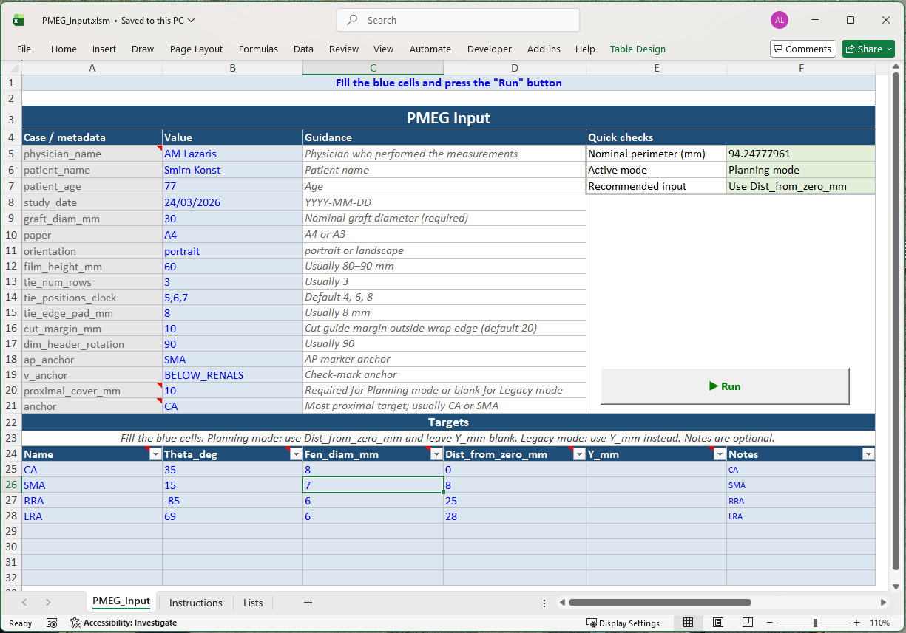

# PMEG Layout Tool - Details

<a id="top"></a>
## 📑 Table of Contents

- [Overview](#overview)
- [Main Features](#main-features)
- [Input Format](#input-format)
  - [Metadata fields](#metadata-fields)
  - [Target fields](#target-fields)
- [⚡ Quick Reference — Input Fields](#-quick-reference--input-fields)
- [Output Files](#output-files)
- [How to Run](#how-to-run)
- [Versioning](#versioning)
- [Notes / Printing Instructions (critical)](#notes--printing-instructions-critical)
- [Safety features](#safety-features)
- [Quick checklist](#quick-checklist)
- [Changelog](#changelog)
- [Disclaimer](#disclaimer)
- [Credits](#credits)
- [Usage Notice](#usage-notice)
- [License](#license)

---

## Overview

The **PMEG Layout Tool** is a clinically oriented, **true-scale (1:1)** digital planning tool for **Physician-Modified Endografts (PMEG)**. 

It generates printable templates that can be cut, rolled, and used directly on the back table to accurately mark fenestrations on the graft fabric.

All calculations are based on the **nominal graft diameter (device)** — **not** the native aortic diameter.

The tool is designed to support precision, reproducibility, and traceability in PMEG planning workflows.

<br>

[⬆️ Top](#top)

---

## Main Features

* True-scale output (**1 mm = 1 mm**) on A4/A3 paper
* Graft unrolling based on nominal diameter (π·D)
* Fenestration positioning using:

  * angular position (`theta_deg`)
  * longitudinal distances
* Dual longitudinal measurement scales:

  * center-to-center distances
  * bottom-to-bottom distances
* Anchor-based planning mode (recommended workflow)
* Automatic conversion from bottom-based measurements to center coordinates
* Reduction tie planning guides (**configurable per case**)
* AP orientation markers (12–6 o’clock)
* Anti-rotation check marker (✓)
* Wrap edges clearly defined (true graft circumference)
* Cut guides with configurable margins
* Physician traceability via `physician_name` metadata
* Automatic patient-specific folder creation with versioning
* Report generation:

  * TXT (human-readable)
  * CSV (structured data for research/reuse)

<br>

[⬆️ Top](#top)

---

## Input Format

### Recommended: Excel (.xlsm)

The Excel input file provides a structured and user-friendly interface.

### Metadata fields

* __patient_name__ : _Free-text identifier for the patient. Displayed in the output files for reference and traceability._
* __patient_age__ : _Patient age (years). Informational only; included in the output header._
* __study_date__ : _Date of the imaging study (CTA). Used for documentation and printed in reports (date-only format)._
* __physician_name__ : _Name of the physician performing the planning. Included in outputs for audit and attribution purposes._
* __graft_diam_mm__ : _Nominal diameter of the endograft (in mm).
⚠️ This value is used to calculate the graft circumference and all angular-to-linear conversions._
* __paper__ : _(A4 / A3)
Defines the output page size.
Affects scaling, layout extent, and printable area._
* __orientation__ : _(portrait / landscape)
Page orientation of the generated layout.
Influences how the graft is “unwrapped” across the page._
* __film_height_mm__ : _Height of the transparent working field (in mm).
Determines the vertical extent of the usable planning area._
* __tie_num_rows__ : _Number of horizontal rows of reduction ties.
Typically between 1–10 (validated in script)._
* __tie_edge_pad_mm__ : _Distance (in mm) from graft edges where tie rows are placed.
Helps avoid edge interference._
* __tie_positions_clock__ : _Clock-face positions of reduction ties (e.g., 4,6,8).
Allows flexible and precise angular placement of ties instead of fixed defaults._
* __cut_margin_mm__ : _Margin (in mm) added around the graft boundary to define cutting guides.
Ensures safe trimming and handling during modification._
* __ap_anchor__ : _Defines the anterior–posterior (AP) reference alignment.
Accepted values may include: SMA, CA, TOP, NONE (extendable).
Used to position the 12–6 o’clock reference line._
* __v_anchor__ : _Controls vertical alignment reference for layout construction.
Options include predefined modes such as TOP, SMA, BELOW__RENALS, etc.
Affects vertical positioning of markers and alignment guides._
* __proximal_cover_mm__ : _Distance (in mm) from the top edge of the graft (fabric edge) to the top of the most proximal fenestration.
Defines the proximal sealing/cover segment._
* __anchor__ : _Defines the reference fenestration used as the longitudinal origin (y = 0).
Commonly set to a key vessel (e.g., CA or SMA).
All vertical distances are measured relative to this anchor._

### Target fields

* __name__ : _Name of the target vessel (e.g., CA, SMA, RRA, LRA).
Used for labeling fenestrations in the output and in summary tables._
* __theta_deg__ *(signed angle: right = positive, left = negative)* : _Circumferential orientation of the target vessel on the graft surface (in degrees).
Right side → positive values (e.g., +45°) - 
Left side → negative values (e.g., -60°).
⚠️ This is a signed clock-face representation, not a 0–360° system.
Used to calculate the horizontal (unwrapped) position of the fenestration._
* __fen_diam_mm__ : _Diameter of the fenestration (in mm).
Used for visual representation and optional labeling in the layout._
* __dist_from_zero_mm__ *(planning mode)*  : _Distance (in mm) from the defined longitudinal reference point (zero level) to the bottom of the fenestration.
The zero level is defined by the selected anchor vessel. 
Positive values indicate positions distal to the anchor. 
✅ This is the recommended field for planning and should be used in standard workflows._
* __y_mm *__  (optional/legacy mode)*: _Absolute vertical position (in mm) measured from the top edge of the graft (fabric edge).
⚠️ Retained for backward compatibility.
Should not be used together with dist_from_zero_mm unless explicitly intended._
* __notes__ : _Optional free-text field for annotations (e.g., anatomical variations, accessory vessels, planning remarks).
Not used in calculations but may appear in output tables or logs._


## ⚡ Quick Reference — Input Fields

### 📌 Metadata

| Field | Description | Example |
|------|-------------|--------|
| `patient_name` | Patient identifier (for display only) | John Doe |
| `patient_age` | Age in years (informational) | 72 |
| `study_date` | CTA date (printed in report) | 2026-03-15 |
| `physician_name` | Planning physician (audit trail) | A. Lazaris |
| `graft_diam_mm` | Nominal graft diameter (used for all calculations) | 28 |
| `paper` | Output page size | A4 / A3 |
| `orientation` | Page orientation | portrait / landscape |
| `film_height_mm` | Height of working field (mm) | 180 |
| `tie_num_rows` | Number of reduction tie rows | 3 |
| `tie_edge_pad_mm` | Distance of ties from graft edge (mm) | 8 |
| `tie_positions_clock` | Clock positions of ties *(v2.12+)* | 4,6,8 |
| `cut_margin_mm` | Margin for cutting guides (mm) | 5 |
| `ap_anchor` | Defines 12–6 o’clock alignment | SMA / CA / TOP / NONE |
| `v_anchor` | Vertical reference mode | TOP / SMA / BELOW__RENALS |
| `proximal_cover_mm` | Distance from graft top to top fenestration (mm) | 20 |
| `anchor` | Reference vessel for longitudinal zero | CA |

---

### 🎯 Target Fields (per vessel)

| Field | Description | Example |
|------|-------------|--------|
| `name` | Target vessel name | SMA |
| `theta_deg` | Signed angle (right + / left −) | -45 |
| `fen_diam_mm` | Fenestration diameter (mm) | 8 |
| `dist_from_zero_mm` | Distance from anchor (recommended) | 25 |
| `y_mm` | Absolute position from graft top *(legacy)* | 60 |
| `notes` | Optional comments | accessory vessel |

---

### 🧠 Key Rules

- Use **`dist_from_zero_mm` (preferred)** OR `y_mm` (legacy), not both  
- Angles are **signed (not 0–360°)**  
- All distances are in **mm**  
- `graft_diam_mm` defines **circumference scaling**

--

_Example of PMEG_Input format_


---

### CSV (legacy support)

Metadata lines are defined using `#`:

```
# patient_name: John Doe
# patient_age: 68
# study_date: 2026-02-01
# physician_name: Dr Jane Smith
# graft_diam_mm: 30
# tie_positions_clock: 5,6,7
```

<br>

[⬆️ Top](#top)

---

## Output Files

Each run generates a **patient-specific folder**:

```
Patients/
  YYYY-MM-DD_PatientName/
    v001_timestamp/
    v002_timestamp/
```

### Main outputs

* PDF (true-scale layout)
* PNG image

Includes:

* millimeter grid
* fenestration markers
* wrap edges
* cut guides
* clock-face orientation
* AP markers
* check marker (✓)
* reduction tie guides
* calibration square (100 × 100 mm)
* measurement scales
* patient metadata


---

### Film output (transparent film)

* simplified geometry for back-table use
* includes:

  * graft boundaries
  * fenestrations
  * AP marker
  * tie guides
  * calibration square


---

### Reports

* `*_REPORT.txt`
* `*_REPORT.csv`

Include:

* all metadata
* physician_name
* fenestration coordinates
* distances:

  * center-to-center
  * bottom-to-bottom
  * anchor-to-target

---

### Additional files

* copy of input file (traceability)
* `last_output_folder.txt` (used by Excel to open latest output)

<br>

[⬆️ Top](#top)

---

## How to Run

### Python

```bash
python pmeg_layout_tool_v2.12.py --input PMEG_Input.xlsm
```

(macOS: use `python3`)

---

### Executable (recommended for users)

1. Open Excel input file
2. Enable macros
3. Click **Run PMEG**
4. Confirm execution
5. Wait until completion
6. Output folder opens automatically

<br>

[⬆️ Top](#top)

---

## Versioning

The tool follows **version-based naming**:

* Script: `pmeg_layout_tool_v2.12.py`
* Current version: **v2.14**

Each version introduces incremental improvements and is documented separately.

Outputs are also versioned per patient (v001, v002, etc.), ensuring full traceability.

---

## Notes / Printing Instructions (critical)

* Print at **100% / Actual Size**
* Disable scaling / fit-to-page
* Verify the **100 × 100 mm calibration square**

If calibration is incorrect → **DO NOT USE**

<br>

[⬆️ Top](#top)

---

## Safety features

* AP marker (12-6 o'clock)
* Check marker (`✓`) to prevent rotation errors
* Wrap edges clearly marked
* Warnings for out-of-bounds fenestrations or incorrect geometry

---

## Quick checklist

* Anchor defined correctly
* Distances are bottom-to-bottom
* `theta_deg` values are correct
* `physician_name` entered when measurements are assigned to a specific physician
* Calibration square verified
* No scaling in printing

---

## Changelog

A detailed version history is available in:

```
changelog.txt
```

<br>

[⬆️ Top](#top)

---

## Disclaimer

This tool supports planning and documentation only.

Users and treating physicians are fully responsible for:

* measurement accuracy
* correct data entry
* clinical interpretation
* procedural execution

The tool does not replace clinical judgment.

---

## Credits

Created by:

* **Michael A. Lazaris**
* **Andreas M. Lazaris**

Tools:

* Python
* Matplotlib
* OpenPyXL
* ChatGPT (OpenAI)

<br>

[⬆️ Top](#top)

---

## Usage Notice

The PMEG Layout Tool is provided for **academic, educational, and research purposes only**.

Commercial use, redistribution, or integration into commercial products is **not permitted** without prior written permission from the authors.

For licensing inquiries, please contact:
andreaslazaris@hotmail.com

---

## License

This project is licensed under the **Creative Commons Attribution-NonCommercial 4.0 International License (CC BY-NC 4.0)**.

Commercial use is not permitted without prior permission.

See the LICENSE file for details.

<br>

[⬆️ Top](#top)


<br>
© 2026


