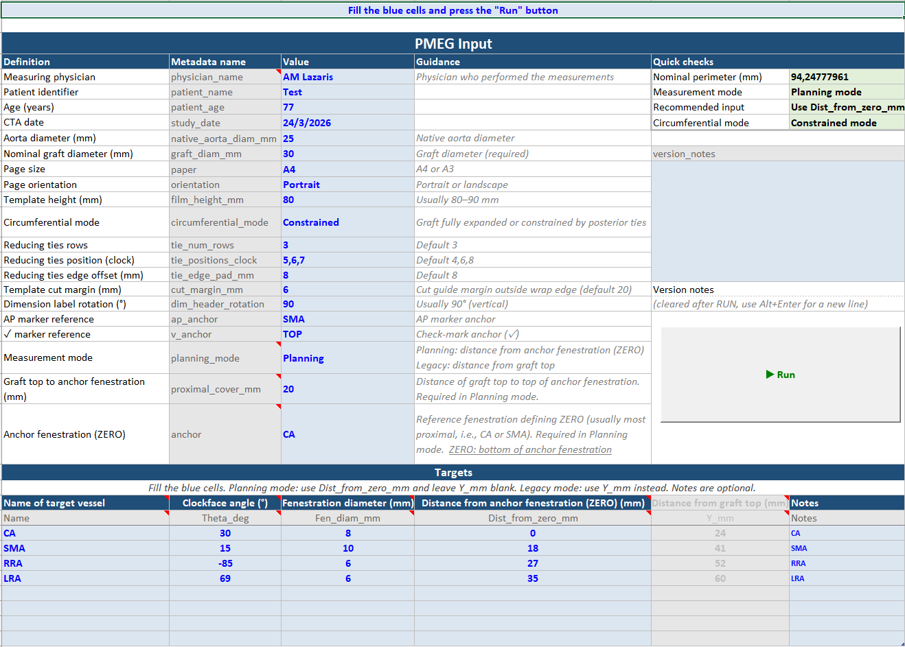
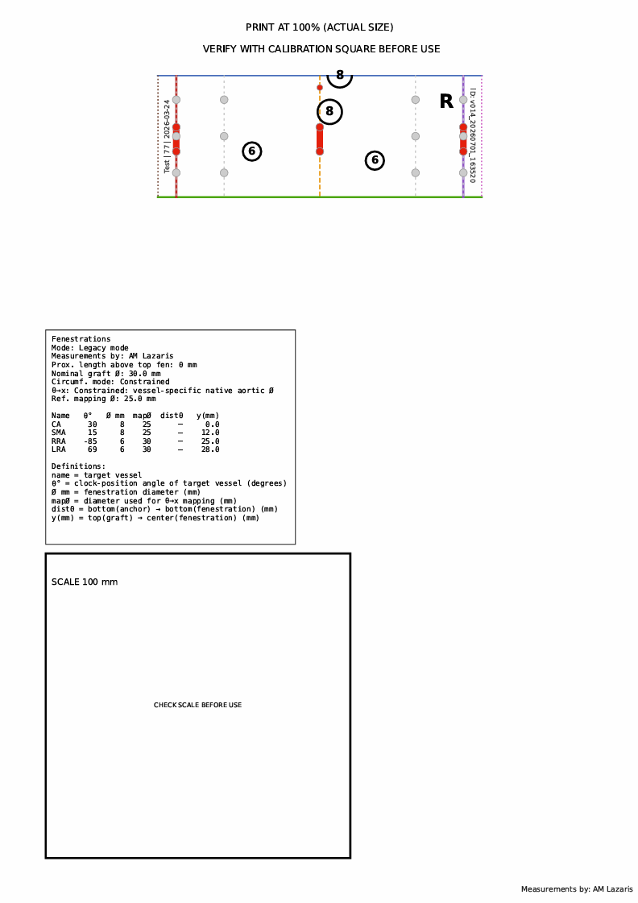
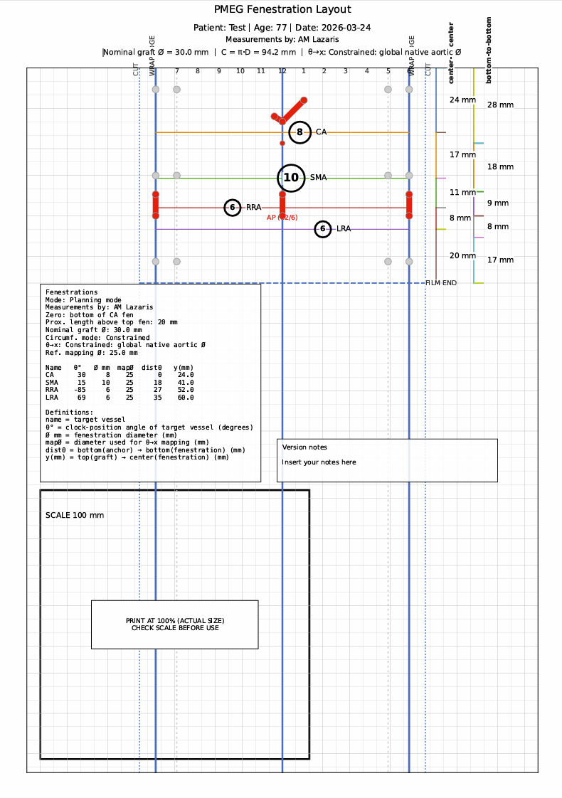
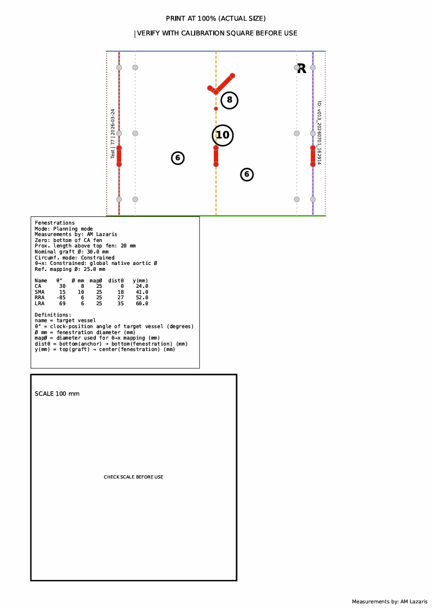

# PMEG Layout Tool - Details

<a id="top"></a>

## Table of Contents

- [Overview](#overview)
- [What the tool does](#what-the-tool-does)
- [Core concepts](#core-concepts)
- [Input file](#input-file)
  - [Recommended input workbook](#recommended-input-workbook)
  - [Metadata fields](#metadata-fields)
  - [Target-vessel fields](#target-vessel-fields)
- [How to plan a fenestrated PMEG](#how-to-plan-a-fenestrated-pmeg)
  - [Step 1 — Prepare the CTA measurements](#step-1--prepare-the-cta-measurements)
  - [Step 2 — Fill the metadata section](#step-2--fill-the-metadata-section)
  - [Step 3 — Fill the target-vessel table](#step-3--fill-the-target-vessel-table)
  - [Step 4 — Choose the circumferential mode](#step-4--choose-the-circumferential-mode)
  - [Step 5 — Add reduction-tie guides](#step-5--add-reduction-tie-guides)
  - [Step 6 — Run the tool and check the outputs](#step-6--run-the-tool-and-check-the-outputs)
- [Planning modes](#planning-modes)
  - [Planning mode — recommended](#planning-mode--recommended)
  - [Legacy mode](#legacy-mode)
  - [Using Legacy mode to create a proximal scallop](#using-legacy-mode-to-create-a-proximal-scallop)
- [Circumferential modes](#circumferential-modes)
- [Reduction ties](#reduction-ties)
- [Orientation markers](#orientation-markers)
- [Output files](#output-files)
- [How to run](#how-to-run)
- [Printing instructions — critical](#printing-instructions--critical)
- [Safety checklist](#safety-checklist)
- [Version notes](#version-notes)
- [Disclaimer](#disclaimer)
- [Credits](#credits)
- [Usage notice](#usage-notice)
- [License](#license)

---

## Overview

The **PMEG Layout Tool** is a clinically oriented, true-scale digital planning tool for **physician-modified endografts (PMEGs)**.

It converts preoperative CTA measurements into an unrolled graft layout that can be printed at **1:1 scale** and used to mark fenestrations, orientation markers, reduction-tie references, and cut guides on the back table.

The tool is intended to support a reproducible planning workflow. It does **not** replace physician judgment, careful CTA review, intraoperative imaging, or final procedural decision-making.

[⬆️ Top](#top)

---

## What the tool does

The tool generates:

- a **main true-scale PDF layout** with grid, fenestrations, orientation references, dimension scales, tables, and calibration square;
- a simplified **transparent film PDF** for back-table use;
- a **clinical TXT report**;
- a **technical TXT report**;
- a structured **CSV report**;
- a patient-specific, versioned output folder containing the input file used for that run.

The main and film PDFs must be printed at **100% / Actual Size** and checked with the 100 × 100 mm calibration square before clinical use.

[⬆️ Top](#top)

---

## Core concepts

### Unrolled graft model

The graft is represented as a rectangle obtained by unrolling the cylindrical graft surface.

- The vertical axis is the graft length.
- The horizontal axis is the graft circumference.
- The 12 o'clock line is placed at the center of the layout.
- The 6 o'clock line corresponds to the posterior wrap edges.

### Nominal graft diameter

The graft wrap boundaries are always based on the **nominal graft diameter**:

```text
Graft circumference = π × nominal graft diameter
```

This defines the true graft perimeter and the wrap edges.

### Signed angular convention

`theta_deg` is a signed angle around the graft:

- `0°` = 12 o'clock / anterior reference line
- positive values = right side of the graft
- negative values = left side of the graft
- `+180°` / `-180°` = posterior 6 o'clock wrap edge

Approximate clock examples:

| Clock position | theta_deg |
|---|---:|
| 12 o'clock | 0 |
| 1 o'clock | +30 |
| 2 o'clock | +60 |
| 3 o'clock | +90 |
| 4 o'clock | +120 |
| 5 o'clock | +150 |
| 6 o'clock | ±180 |
| 7 o'clock | -150 |
| 8 o'clock | -120 |
| 9 o'clock | -90 |
| 10 o'clock | -60 |
| 11 o'clock | -30 |

[⬆️ Top](#top)

---

## Input file

### Recommended input workbook

The recommended input file is:

```text
PMEG_Input_v2.25.xlsm
```

The workbook contains a `PMEG_Input` sheet with two main areas:

1. **Metadata section** — case, graft, page, marker, reduction-tie, and planning settings.
2. **Target-vessel table** — one row for each target vessel.

The script reads the metadata by looking for recognized metadata names and then reading the value in the adjacent cell to the right. Therefore, the important element is the metadata name/value pair, not the absolute Excel cell address.

The workbook also includes lists/dropdowns for common values such as page size, orientation, planning mode, circumferential mode, anchors, target names, and standard tie-position presets.

[⬆️ Top](#top)

---

### Metadata fields

| Field | Required? | Description | Typical value |
|---|---:|---|---|
| `physician_name` | No | Physician performing the planning/measurements. Printed in reports and layouts. | `A. Lazaris` |
| `patient_name` | No | Patient identifier for traceability. | `Patient_001` |
| `patient_age` | No | Patient age. Informational only. | `77` |
| `study_date` | No | CTA date. | `2026-03-15` |
| `native_aorta_diam_mm` | Conditional | Global native aortic diameter used as fallback in Constrained mode. | `25` |
| `graft_diam_mm` | Yes | Nominal endograft diameter. Defines the graft circumference and wrap edges. | `30` |
| `paper` | Yes | Page size. | `A4` or `A3` |
| `orientation` | Yes | Page orientation. | `Portrait` or `Landscape` |
| `film_height_mm` | No | Height of the transparent working film field. | `80` or `90` |
| `circumferential_mode` | No | Circumferential mapping method. | `Nominal` or `Constrained` |
| `tie_num_rows` | No | Number of horizontal rows for reduction-tie markers. Use `0` to disable tie guides. | `3` |
| `tie_positions_clock` | No | Three clock positions for posterior reducing ties. Leave blank/None to disable. Decimal values are accepted. | `4,6,8` or `4.5,6,7.5` |
| `tie_edge_pad_mm` | No | Vertical offset of tie rows from the film edges. | `8` |
| `cut_margin_mm` | No | Cutting margin outside the graft wrap edge. | `6` or `20` |
| `dim_header_rotation` | No | Rotation of dimension-scale labels. | `90` |
| `ap_anchor` | No | Positioning reference for the AP 12/6 marker. | `SMA`, `CA`, `TOP`, `NONE` |
| `v_anchor` | No | Positioning reference for the ✓ anti-rotation marker. | `BELOW_RENALS`, `CA`, `SMA`, `TOP`, `NONE` |
| `planning_mode` | Yes recommended | Selects the active longitudinal input method. | `Planning` or `Legacy` |
| `proximal_cover_mm` | Planning mode only | Distance from graft top edge to the **top edge** of the anchor fenestration. | `20` |
| `anchor` | Planning mode only | Target vessel used as the longitudinal zero reference. Usually the most proximal fenestration. | `CA` or `SMA` |
| `version_notes` | No | Free-text notes for the current planning version. | `CA shifted 2 mm distal` |


_Example of PMEG_Input format_



[⬆️ Top](#top)

---

### Target-vessel fields

| Field | Required? | Description | Example |
|---|---:|---|---|
| `Name` | Yes | Target vessel label. | `CA`, `SMA`, `RRA`, `LRA` |
| `Theta_deg` | Yes | Signed circumferential angle. Right = positive, left = negative. | `+30`, `-85` |
| `Fen_diam_mm` | Yes | Fenestration diameter. | `8` |
| `Dist_from_zero_mm` | Planning mode | Bottom-to-bottom distance from anchor fenestration to the target fenestration. | `18` |
| `Y_mm` | Legacy mode | Distance from graft top edge to the **center** of the fenestration. | `41` |
| `native_aorta_diam_mm` | Conditional | Target-level native aortic diameter for Constrained mode. If filled, it overrides the global value for that row. | `25`, `30` |
| `Notes` | No | Optional comment. | `accessory renal` |

[⬆️ Top](#top)

---

## How to plan a fenestrated PMEG

This is the recommended practical workflow for a standard fenestrated PMEG.

### Step 1 — Prepare the CTA measurements

For each target vessel, decide:

1. **Target name** — for example CA, SMA, RRA, LRA.
2. **Clock position / angle** — convert the target vessel clock position into `theta_deg`.
3. **Fenestration diameter** — planned fenestration size in mm.
4. **Longitudinal distance** — preferably measured bottom-to-bottom from the anchor fenestration.
5. **Native aortic diameter at that level** — especially if using Constrained mode.

Recommended longitudinal measurement method:

- Select the most proximal fenestration as the anchor, commonly CA or SMA.
- Define zero as the **bottom edge of the anchor fenestration**.
- Measure the distance from that zero point to the **bottom edge** of each other target fenestration.

This bottom-to-bottom method is usually easier to reproduce on CTA centerline reconstructions and avoids repeated manual center calculations.

[⬆️ Top](#top)

---

### Step 2 — Fill the metadata section

In `PMEG_Input_v2.25.xlsm`, fill the blue value cells in the metadata section.

For a typical four-fenestration PMEG:

| Metadata field | Suggested entry |
|---|---|
| `physician_name` | Name/initials of the planning physician |
| `patient_name` | Patient identifier |
| `study_date` | CTA date |
| `graft_diam_mm` | Nominal device diameter, for example `30` |
| `paper` | `A4` or `A3` |
| `orientation` | Usually `Portrait` for shorter paravisceral layouts; `Landscape` if more horizontal space is needed |
| `film_height_mm` | Usually `80–90` mm, or longer if the working segment is longer |
| `planning_mode` | `Planning` |
| `proximal_cover_mm` | Planned fabric length from graft top to top of anchor fenestration |
| `anchor` | Usually `CA` if CA is the most proximal fenestration, otherwise `SMA` |
| `circumferential_mode` | `Nominal` or `Constrained` |
| `tie_positions_clock` | For example `4,6,8`, `5,6,7`, or `4.5,6,7.5` |

Important: in Planning mode, `proximal_cover_mm` is the distance from the graft top edge to the **top edge** of the anchor fenestration, not to its center.

[⬆️ Top](#top)

---

### Step 3 — Fill the target-vessel table

In the target-vessel table, enter one row per vessel.

Example for Planning mode:

| Name | Theta_deg | Fen_diam_mm | Dist_from_zero_mm | Y_mm | native_aorta_diam_mm | Notes |
|---|---:|---:|---:|---:|---:|---|
| CA | 30 | 8 | 0 | | 25 | CA |
| SMA | 15 | 10 | 18 | | 25 | SMA |
| RRA | -85 | 6 | 27 | | 30 | RRA |
| LRA | 69 | 6 | 35 | | 30 | LRA |

Rules:

- In **Planning mode**, use `Dist_from_zero_mm` and leave `Y_mm` blank.
- The anchor row may be entered as `0` in `Dist_from_zero_mm`.
- For all non-anchor vessels, `Dist_from_zero_mm` is the distance from the **bottom of the anchor fenestration** to the **bottom of that target fenestration**.
- If Constrained mode is used, fill `native_aorta_diam_mm` for each target level when the aortic diameter differs between levels.
- If all target levels use the same native aortic diameter, the global metadata value `native_aorta_diam_mm` can be used as fallback.

The script automatically converts these measurements into `y_mm`, which is the center position used for plotting.

[⬆️ Top](#top)

---

### Step 4 — Choose the circumferential mode

Choose `Nominal` or `Constrained` in `circumferential_mode`.

Use **Nominal** when the fenestration horizontal positions should be calculated directly on the fully expanded nominal graft circumference.

Use **Constrained** when posterior diameter-reducing ties are expected to reduce the effective posterior circumference during partial deployment and you want a first-order compensation based on the native aortic diameter at the target-vessel level.

In Constrained mode:

- the graft wrap/cut boundaries still use the nominal graft diameter;
- each fenestration x-position may use the target-level `native_aorta_diam_mm`;
- if a target-level diameter is missing, the script uses the global `native_aorta_diam_mm`, `aorta_diam_mm`, or `mapping_diam_mm` metadata value;
- if no global or target-specific native diameter is provided, the script will stop and ask for the missing value.

[⬆️ Top](#top)

---

### Step 5 — Add reduction-tie guides

Set:

```text
tie_num_rows
tie_positions_clock
tie_edge_pad_mm
```

Examples:

| Desired tie pattern | `tie_positions_clock` |
|---|---|
| Classic posterior pattern | `5,6,7` |
| Wider posterior pattern | `4,6,8` |
| Symmetric posterior-lateral pattern | `3,6,9` |
| Intermediate custom pattern | `4.5,6,7.5` |
| No tie guides | leave blank, enter `None`, or set `tie_num_rows = 0` |

Decimal clock positions are accepted. The script requires exactly three distinct clock positions unless tie guides are disabled.

The 6 o'clock tie position is drawn on both posterior wrap edges of the unrolled graft.

[⬆️ Top](#top)

---

### Step 6 — Run the tool and check the outputs

After completing the workbook:

1. Save the workbook. When running the Windows app, by clicking the **Run** button, the workbook is automatically saved. 
2. Click the **Run** button in Excel, or run the Python script directly.
3. Open the output folder.
4. Review the main PDF first.
5. Review the film PDF.
6. Check the TXT/CSV reports for the calculated coordinates and distances.
7. Print at 100% / Actual Size.
8. Measure the 100 × 100 mm calibration square with a ruler.

Do not use the printed template if the calibration square is not exactly correct.

[⬆️ Top](#top)

---

## Planning modes

### Planning mode — recommended

Planning mode is the standard workflow for most fenestrated PMEG designs.

Metadata required:

```text
planning_mode = Planning
proximal_cover_mm = <distance from graft top to top of anchor fenestration>
anchor = <anchor target name>
```

Target-table fields used:

```text
Name
Theta_deg
Fen_diam_mm
Dist_from_zero_mm
native_aorta_diam_mm
Notes
```

The script defines:

```text
ZERO = bottom edge of the anchor fenestration
```

For the anchor fenestration:

```text
y_anchor_center = proximal_cover_mm + anchor_fen_diam_mm / 2
```

For each non-anchor fenestration:

```text
y_target_center = ZERO + Dist_from_zero_mm - target_fen_diam_mm / 2
```

In Planning mode, any values in `Y_mm` are ignored.

[⬆️ Top](#top)

---

### Legacy mode

Legacy mode uses absolute longitudinal center positions.

Metadata:

```text
planning_mode = Legacy
```

Target-table fields used:

```text
Name
Y_mm
Theta_deg
Fen_diam_mm
native_aorta_diam_mm
Notes
```

Here:

```text
Y_mm = distance from graft top edge to fenestration center
```

In Legacy mode, `Dist_from_zero_mm`, `anchor`, and `proximal_cover_mm` are ignored.

Legacy mode is useful when:

- you already know the absolute center position of each fenestration from the graft top edge;
- you are reproducing an older case;
- you want to place a proximal target at the graft edge to create a scallop-type marking.

[⬆️ Top](#top)

---

### Using Legacy mode to create a proximal scallop

A proximal scallop can be represented by placing the target-vessel circle at the proximal edge of the graft.

This is useful, for example, when the most proximal target vessel is the **celiac artery (CA)** and the intended modification is a scallop rather than a full fenestration.

Suggested workflow:

1. Set:

```text
planning_mode = Legacy
```

2. In the target-vessel table, enter the scallop target vessel, for example:

```text
Name = CA
Y_mm = 0
Theta_deg = 0 or the measured CA angle
Fen_diam_mm = planned scallop width/depth reference
```

3. Enter the remaining vessels as standard fenestrations using their absolute `Y_mm` center positions from the graft top edge.

4. Leave Planning-mode fields such as `Dist_from_zero_mm`, `anchor`, and `proximal_cover_mm` blank or ignore them.

Practical interpretation:

- `Y_mm = 0` places the center of the circular target marker on the graft top edge.
- The lower half of the circle lies inside the graft fabric and can be used as a proximal scallop marking guide.
- This is a geometric marking aid. The surgeon must still decide the final scallop shape, reinforcement, and intraoperative adjustment.

Example:

| Name | Theta_deg | Fen_diam_mm | Dist_from_zero_mm | Y_mm | native_aorta_diam_mm | Notes |
|---|---:|---:|---:|---:|---:|---|
| CA | 0 | 10 | | 0 | 25 | proximal scallop |
| SMA | 15 | 10 | | 28 | 25 | fenestration |
| RRA | -85 | 6 | | 43 | 30 | fenestration |
| LRA | 69 | 6 | | 51 | 30 | fenestration |

Note: if the CA scallop is not centered at 12 o'clock, use the measured `Theta_deg` rather than `0`.


_Example of tranparent film PDF tempate with scallop_



[⬆️ Top](#top)

---

## Circumferential modes

### Nominal mode

```text
circumferential_mode = Nominal
```

In Nominal mode:

```text
x_mm = theta_deg / 360 × π × graft_diam_mm
```

Use this when the fenestrations should be mapped on the nominal graft circumference.

### Constrained mode

```text
circumferential_mode = Constrained
```

In Constrained mode:

```text
x_mm = theta_deg / 360 × π × native_aorta_diam_mm
```

The graft boundary remains based on the nominal graft diameter, but the fenestration x-position is calculated using the native aortic diameter at the target level.

This mode is intended as a first-order correction for cases where posterior reducing ties constrain the graft and the anterior target-vessel region is expected to behave closer to the native aortic diameter during partial deployment.

Target-specific diameters are preferred when the aortic diameter changes along the paravisceral segment.

[⬆️ Top](#top)

---

## Reduction ties

Reduction-tie guides are optional.

They are controlled by:

```text
tie_num_rows
tie_positions_clock
tie_edge_pad_mm
```

Important details:

- `tie_positions_clock` accepts decimal clock values, for example `4.5,6,7.5`.
- Blank `tie_positions_clock` disables tie guides.
- `None`, `no`, `off`, `false`, `0`, or `null` also disable tie guides.
- `tie_num_rows = 0` disables tie guides.
- If enabled, exactly three distinct clock positions are required.
- The 6 o'clock position is drawn on both wrap edges.

[⬆️ Top](#top)

---

## Orientation markers

The tool includes two orientation aids.

### AP marker

The AP marker is a red 12/6 o'clock reference marker. It can be positioned using:

```text
ap_anchor
```

Common values:

```text
SMA
CA
TOP
NONE
```

### Check marker

The ✓ marker is a non-symmetric red marker designed to help detect a 180° rotational error.

It is controlled by:

```text
v_anchor
```

Common values:

```text
BELOW_RENALS
CA
SMA
TOP
NONE
```

[⬆️ Top](#top)

---

## Output files

If no custom output path is provided, the tool creates a patient-specific folder:

```text
Documents/
  PMEG Layout Tool/
    Patients/
      YYYY-MM-DD_PatientName/
        v001_YYYYMMDD_HHMMSS/
        v002_YYYYMMDD_HHMMSS/
```

Each run contains:

```text
PMEG_LAYOUT.pdf
PMEG_LAYOUT_FILM.pdf
PMEG_LAYOUT_REPORT.txt
PMEG_LAYOUT_REPORT_TECHNICAL.txt
PMEG_LAYOUT_REPORT.csv
copy of the input workbook or CSV
```

The tool also writes:

```text
last_output_folder.txt
```

This pointer is used by the Excel/VBA workflow to open the most recent output folder.


_Example of main PDF layout_



_Example of transparent film PDF template_



[⬆️ Top](#top)

---

## How to run

### From Excel on Windows

1. Open `PMEG_Input_v2.25.xlsm`.
2. Enable macros if prompted.
3. Fill the blue cells.
4. Click the **Run** button.
5. Review the generated output folder.

### From Python

```bash
python PMEG_layout_tool_v2.25.py --input PMEG_Input_v2.25.xlsm
```

On macOS or Linux, you may need:

```bash
python3 PMEG_layout_tool_v2.25.py --input PMEG_Input_v2.25.xlsm
```

CSV input is also supported, but the Excel workbook is the recommended user-facing input method.

[⬆️ Top](#top)

---

## Printing instructions — critical

Always print the PDFs at:

```text
100% / Actual Size
```

Disable:

```text
Fit to page
Shrink oversized pages
Scale to fit
```

Before clinical use:

1. Measure the 100 × 100 mm calibration square on the main PDF.
2. Measure the 100 × 100 mm calibration square on the film PDF.
3. Use the film template only if the calibration is correct.
4. Trim along the CUT lines.
5. Confirm graft orientation before marking or cutting.

If the calibration square is not exactly correct, do not use the printout.

[⬆️ Top](#top)

---

## Safety checklist

Before using the template clinically, confirm:

- The correct patient and CTA date are shown.
- The nominal graft diameter is correct.
- The selected graft diameter matches the device being modified.
- The planning mode is correct: Planning or Legacy.
- The anchor vessel is correct when using Planning mode.
- `proximal_cover_mm` was measured to the top of the anchor fenestration.
- `Dist_from_zero_mm` values are bottom-to-bottom distances when using Planning mode.
- `Y_mm` values are center positions from the graft top when using Legacy mode.
- `theta_deg` follows the signed angle convention.
- Circumferential mode is appropriate: Nominal or Constrained.
- Native aortic diameters are entered when using Constrained mode.
- Reduction-tie positions are appropriate for the intended constraining technique.
- AP marker and ✓ marker are visible and correctly positioned.
- The 100 × 100 mm calibration square is correct after printing.
- The final layout has been reviewed by the responsible physician before graft modification.

[⬆️ Top](#top)

---

## Version notes

### v2.25 highlights

- Supports **Nominal** and **Constrained** circumferential modes.
- Supports target-level `native_aorta_diam_mm` values for vessel-specific constrained mapping.
- Supports flexible reduction-tie positions, including decimal clock positions such as `4.5,6,7.5`.
- Allows reduction-tie guides to be disabled by blank/None `tie_positions_clock` or `tie_num_rows = 0`.
- Uses explicit **Planning** and **Legacy** longitudinal modes.
- Produces main PDF, film PDF, clinical report, technical report, and CSV report.
- Creates patient-specific versioned output folders for traceability.
- Includes AP and ✓ anti-rotation markers.
- Includes main and film calibration squares.

[⬆️ Top](#top)

---

## Disclaimer

This tool is provided for planning, documentation, education, and research support.

The user and treating physician remain fully responsible for:

- CTA measurement accuracy;
- correct data entry;
- graft/device selection;
- interpretation of the generated layout;
- intraoperative imaging and verification;
- final graft modification;
- clinical decision-making and patient outcome.

The PMEG Layout Tool does not replace clinical judgment, regulatory requirements, institutional governance, or procedural expertise.

[⬆️ Top](#top)

---

## Credits

Created by:

- **Michael A. Lazaris**
- **Andreas M. Lazaris**

Built with:

- Python
- Matplotlib
- OpenPyXL

[⬆️ Top](#top)

---

## Usage notice

The PMEG Layout Tool is provided for **academic, educational, and research purposes only**.

Commercial use, redistribution, or integration into commercial products is not permitted without prior written permission from the authors.

For licensing inquiries, please contact:

```text
andreaslazaris@hotmail.com
```

[⬆️ Top](#top)

---

## License

This project is licensed under the **Creative Commons Attribution-NonCommercial 4.0 International License (CC BY-NC 4.0)**.

Commercial use is not permitted without prior written permission.

See the LICENSE file for details.

<br>

© 2026
