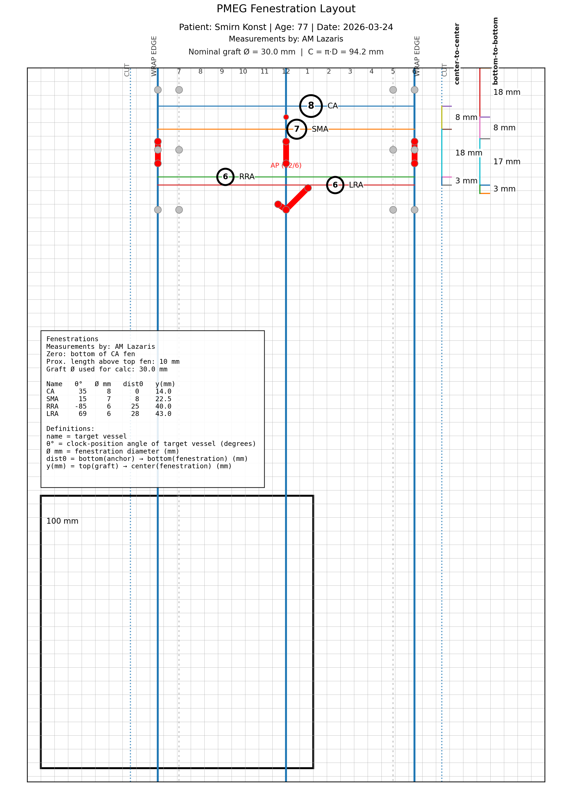
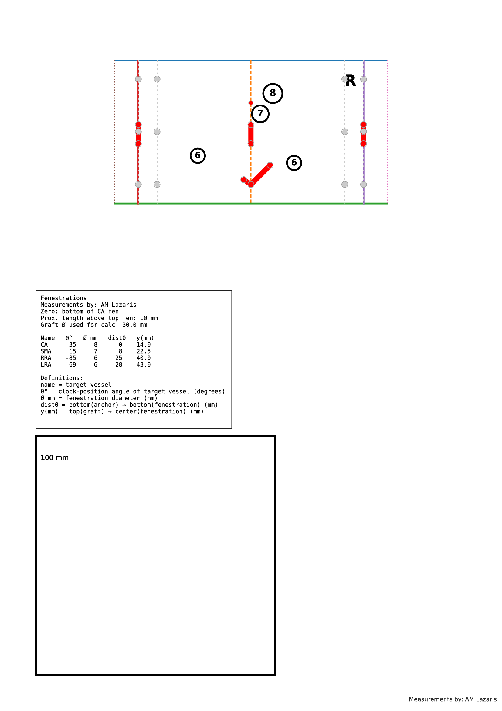

# PMEG Layout Tool

## Overview

The **PMEG Layout Tool** is a clinically oriented, **true-scale (1:1)** digital planning tool for **Physician-Modified Endografts (PMEG)**.

It converts CTA measurements into a printable, patient-specific template that can be cut, wrapped, and used directly on the back table to accurately mark fenestrations on the graft fabric.

The tool is designed to improve:

- Precision
- Reproducibility
- Workflow standardization
- Traceability in PMEG planning

**Example of Main PMEG Layout Output**:

---

## Quick Start

👉 [Download the latest release (.exe)](https://github.com/andreaslazaris/PMEG-Layout-Tool/releases/latest), and install it on a Windows system

Requirements:
- Microsoft Excel (required to run the input file)

---

## Platform Support
- Windows: Fully supported via standalone .exe
- macOS / Linux: Supported via Python version (on request)

📩 Contact: andreaslazaris@hotmail.com

---

## Core Principle

All calculations are based on the:

- 👉 Nominal graft diameter (device)
- ❗ NOT the native aortic diameter

This ensures an accurate geometric representation of the graft surface.

---

## What the Tool Produces
- True-scale (1 mm = 1 mm) printable layouts (A4 / A3)
- Unwrapped graft surface representation
- Fenestration positioning based on:
- Circumferential orientation (θ)
- Longitudinal position (y)
- Vessel diameter (d)

---

## Example of PMEG Layout Film Output

---

## Why this tool?

- Standardizes PMEG planning
- Improves accuracy and reproducibility
- Reduces operator dependency
- Provides full procedural traceability

---

## Key Features

- True-scale output (1 mm = 1 mm)
- Graft unwrapping based on nominal diameter
- Fenestration positioning (θ, y)
- AP orientation markers (12–6 o’clock)
- Reduction tie guides
- Patient-specific output folders
- PDF + PNG outputs

---

## How to Run

### Windows (**Recommended**)
- Download and install the latest `.exe` setup release 
- From your Desktop, run the 'PMEG Input' application or open `PMEG_Input.xlsm` (located in `\Documents\PMEG Layout Tool\`)
- Enable macros
- Click **Run PMEG**

### Command line (Advanced)

`python pmeg_layout_tool_v2.13.py --input PMEG_Input.xlsm`.

For full CLI options, andreaslazaris@hotmail.com

---

### Documentation
For full instructions and technical details:

See [DETAILS.md](DETAILS.md)

---

### Disclaimer
This tool is intended for academic and research purposes only.

It supports procedural planning but does not replace clinical judgment, manufacturer guidelines, or regulatory requirements.

Clinical responsibility remains with the treating physician.

---

### Licence
This project is licensed under the Creative Commons Attribution-NonCommercial 4.0 International License (CC BY-NC 4.0).

Commercial use is not permitted without prior permission.

See the [LICENSE](LICENSE) file for details.

---

## Credits

Created by:

* **Michael A. Lazaris**
* **Andreas M. Lazaris**

Tools:

* Python
* Matplotlib
* OpenPyXL
* ChatGPT (OpenAI)

© 2026
